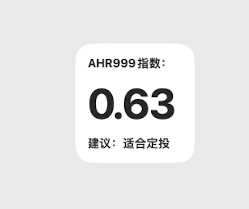
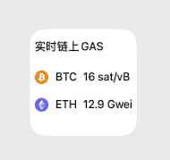

 
 <h2 align="center">币圈 Scriptables 脚本合集</h2>
 

 
 
iOS14桌面组件神器（Scriptable）原创脚本，精美作品收集、分享！ 如果喜欢，欢迎点个 ★ Star ★ 给予小支持，感谢您的使用！  喜欢这个项目？有好的脚本？请考虑留言来帮助完善它！

 
如果您使用过程中发现有问题或可以改进的流程，请提出 Issue 或 Pull request ！

---

---

##  📌 项目代码已全部开源，欢迎提交`PR`

## 目录
- [如何使用](#如何使用)
- [AHR999](#AHR999)
- [链上GAS](#链上GASS)
- [常见问题解答](#常见问题解答)

## TODO

- [x] #739

### 🟠🟡🟢如何使用
1. iPhone 上下载 [Scriptable](https://apps.apple.com/cn/app/scriptable/id1405459188) App（确保你的系统已更新为 iOS14+）. 
2. 打开App，点击右上角 + 号，复制项目中对应的代码  
3. 长按桌面，添加组件，选择 `Scriptable`，然后点击组件配置，选择刚刚保存的脚本即可.
4. 尽情享受吧！   

#### AHR999

文件路径：widget/AHR999.js

#### 链上GAS

文件路径：widget/gas小组件.js

### 🟠🟡🟢感谢
* [Nicolasking007](https://github.com/Nicolasking007)

......
### 🟠🟡🟢访问量
---

- 更多好玩、有趣的脚本正在码字中...`尽情期待哦！`